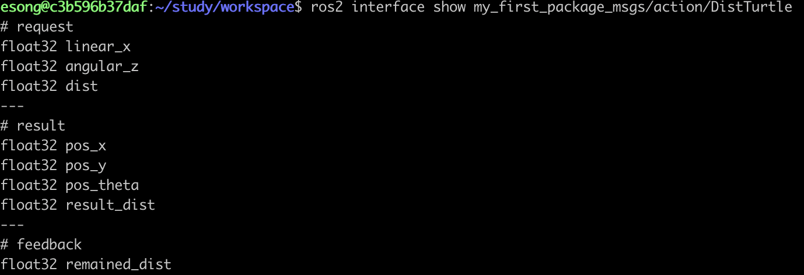

# 액션 정의 만들기
<br>

### 액션 정의 구조

```
<Request>
---
<Result>
---
<Feedback>
```
<br>

---
<br>

### 액션 정의 만들기

만들어줄 액션은 **turtlesim 거북이를 사용자가 주는 선속도와 각속도로 움직여 목표 거리만큼 이동시키고, 이동 중간중간 남은 거리를 피드백으로 주고, 이동 완료 후 거북이의 최종 좌표와 자세를 반환해주는** 액션이다.

```
# request
float32 linear_x
float32 angular_z
float32 dist

---
# result
float32 pos_x
float32 pos_y
float32 pos_theta
float32 result_dist

---
# feedback
float32 remained_dist
```

**result 에 성공/실패 여부만 넣어주면 될 것 같은데 x, y, theta 까지 넣어주는 이유는 뭘까**

result에 최종 좌표(x, y)와 자세(theta)를 넣어주면, 실패했더라도 **그 상태를 기준으로 새로운 액션을 이어갈 수 있는 기반**이 생김(방향을 틀어야한다던가, 다시 처음 자리로 돌아와야한다던가..)

result를 단순한 ‘성공/실패 보고’로만 보지말고, ‘다음 단계 계획을 위한 최종 스냅샷’이라고 봐주기
<br><br>

---
<br>

### 빌드해주기

**빌드 전 파일 수정**
<br>

- **action_msgs 패키지 의존으로 추가해주기**
    
    ```
    <depand>action_msgs</depand>
    ```
    
    액션 정의 시에는 메세지, 서비스 정의할 때와 다르게 빌드 시 package.xml 파일에 위의 내용을 추가하여, action_msgs를 의존으로 추가해주어야 한다.
    
    메세지나 서비스와 달리 액션은 보내기만 하고 끝나는 게 아니라, 보내고, 중간중간 피드백 전달하고, 답장까지 받는 시스템이다. 이때 필요한 규칙과 메세지를 모아놓은 패키지가 action_msgs이다. 그래서 액션을 사용하려면 이 패키지를 의존으로 추가해주어야 한다.
<br><br>

- **CMakeLists.txt에 액션 추가**
    
    ```
    rosidl_generate_interfaces(${PROJECT_NAME}
      "msg/CmdAndPoseVel.msg"
      "srv/MultiSpawn.srv"
      "action/DistTurtle.action"
    )
    ```
<br><br>    

- **package.xml 파일 수정**
    
    ```
    <build_depend>rosidl_default_generators</build_depend>
    <exec_depend>rosidl_default_runtime</exec_depend>
    <member_of_group>rosidl_interface_packages</member_of_group>
    ```
    
<br>

**빌드하기**

```
colcon build
source install/setup.bash
```

<br>

**잘 됐는지 확인해보기**

```
ros2 interface show my_first_package_msgs/action/DistTurtle
```
<br>



---