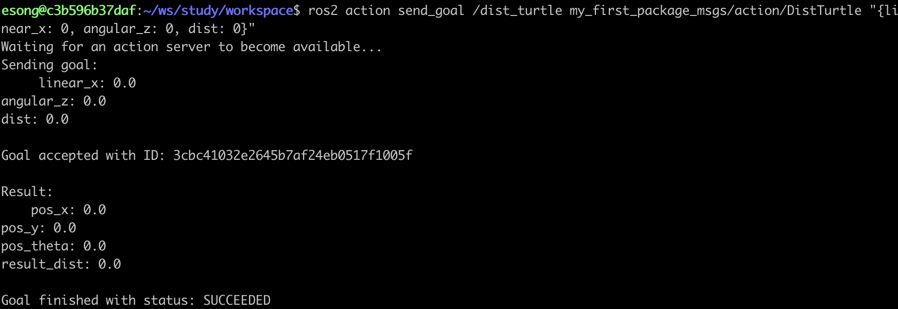

# 간단한 서버 만들기

### 1. imoprt 해주기
```
import rclpy
from rclpy.action import ActionServer
from rclpy.node import Node
from my_first_package_msgs.action import DistTurtle
```

- 액션은 토픽, 서비스와 달리 ActionServer 클래스가 따로 필요하니, rclpy.action.ActionServer 클래스 import 해주기
- 토픽, 서비스는 `create_` 함수를 사용하여 내부적으로 객체를 생성하고, 액션은 직접 생성자 호출해서 클래스를 생성한다.
<br><br>

### 2. DistTurtleServer의 __init__ 함수 작성하기

```python
def __init__(self):
		super().__init__('dist_turtle_action_server')
		self.action_server = ActionServer(
				self,
				DistTurtle,
				'dist_turtle',
				self.execute_callback)
```

- **ActionServer 객체 생성해주기**
    
    ActionServer 객체 내에서 goal 상태, feedback, result, 동시 요청 처리 등 모든 걸 관리함
<br><br>  

### 3. 액션 서버의 콜백함수 작성하기

```python
def execute_callback(self, goal_handle):
		goal_handle.succeed()
		rsesult = DistTurtle.Result()
		return result
```

현재는 goal이 들어와서 콜백함수가 실행되면, 무조건 goal 상태를 성공으로 변경해주고, result 데이터에 아무것도 넣지 않고 바로 반환 중이다.

- **execte_callback 함수**
    
    액션 서버에 Goal 이 들어왔을 때 호출되는 함수이다. goal_handle 에는 클라이언트가 보낸 Goal 정보 + 상태 관리 메서드가 들어있다.
<br><br>

- **goal_handle.succeed, goal_handle.abort 함수**
    
    이 두 함수는 Goal 상태를 변경해주는 함수이다.
    
    succeed 함수는 성공으로 변경해주고, abort 함수는 실패로 변경해줌
<br><br>

- **result = DistTurtle.Result()**
    
    Result 객체를 생성하는 부분이다.
    
    객체 생성 후, 응답 보내줄 데이터를 채워준 후 반환하면 된다.
<br><br>

### 4. 서버에 goal 보내보기
