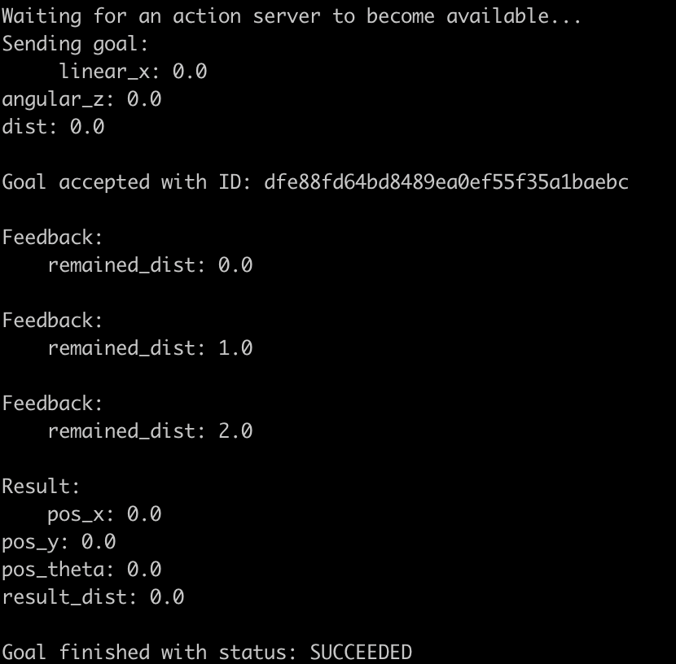

# 서버 만들기 - feedback 발행

### 1. import 추가해주기

```python
import time
```

sleep 함수 사용을 위해 time 모듈 import 해주기
<br><br>

### 2. feedback 추가해주기

```python
	def execute_callback(slef, goal_handle):
		
		feedback_msg = DistTurtle.Feedback()

		for n in range(0, 3):
			feedback_msg.remained_dist = float(n)
			goal_handle.publish_feedback(feedback_msg)
			time.sleep(0.5)

		goal_handle.succeed()
		result = DistTurtle.Result()
		return result
```

- **feedback_msg = DistTurtle.Feedback()**: 피드백 데이터 담아줄 Feedback 객체 생성해주기
    

- **goal.handle.publish_feedback(feedback_msg)**: 피드백 전달해주기
<br><br>

### 3. 서버에 goal 보내기

- **feedback 확인을 위해 --feedback 옵션 추가해주기**
    
    ```bash
    ros2 action send_goal --feedback  /dist_turtle my_first_package_msgs/action/DistTurtle "{linear_x: 0, angular_z: 0, dist: 0}"
    ```
<br>

