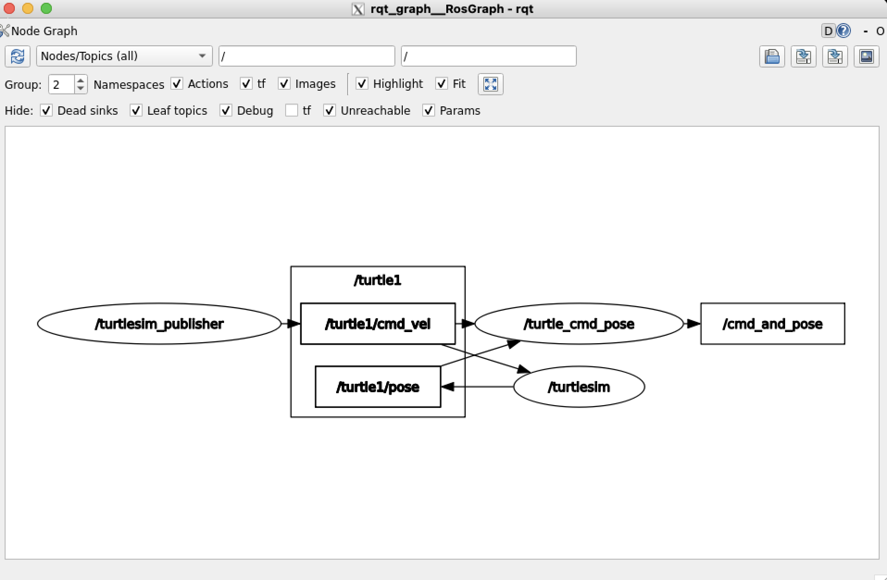

# 두 개의 토픽 구독하고 하나의 토픽 발행하기

## 생성할 노드가 하는 일

- `turtlesim_node`가 발행하는 `/turtle1/pose` 토픽을 구독
- `my_first_package`의 `my_publisher` 노드가 발행한는 `/turtle1/cmd_vel` 토픽을 구독
- 구독한 두 토픽에서 얻은 데이터를 `my_first_package_mags`에 정의한 `CmdAndPose` 메시지 타입에 담아 새로운 토픽으로 발행
<br><br>

## 노드 생성 전 세팅해주기
<br>

**필요한 모듈 가져오기**

- **ros2 사용을 위한 모듈**
    
    ```python
    import rclpy
    from rclpy.node import Node
    ```
    
    - `rclpy`: python에서 ros2 사용을 하기 위해 필요한 모듈
    - `rclpy.node.Node`: 노드 생성과 실행을 위해 필요한 모듈
<br><br>

- **토픽 구독에서 사용할 메세지 타입 불러오기**
    
    ```python
    from turtlesim.msg import Pose
    from geometry_msgs.msg import Twist
    ```
    
    구독할 토픽 `/turtle1/pose`와 `/turtle1/cmd_vel`에서 각각 사용되는 메세지 타입 `Pose`와 `Twist` 불러오기
<br><br>    

- **구독한 두 토픽에서 얻은 데이터를 담아줄 메세지 타입 불러오기**
    
    ```python
    from my_first_pakage_msgs.msg import CmdAndPoseVel
    ```
    
    `my_first_package_msgs` 패키지에 직접 정의했었던 `CmdAndPoseVel` 메세지 타입 불러오기
<br><br>

**ros2 초기화해주기**

```python
rclpy.init()
```

python 에서 ros2 기능을 사용하기 위해선 반드시 rclpy 초기화 해주어야 한다. import 했다고 해서 기능 사용할 수 있는 거 아님
<br><br>


## 커스텀 노드 클래스 정의하기
<br>

**클래스 선언하고 생성자 초기화해주기**

```python
class CmdAndPose(Node):

		def __init__(self):
				super().__init__('turtle_cmd_pose')
```
<br>

- **Node 클래스 상속해주기**
    
    ```python
    class CmdAndPose(Node):
    ```
    
    커스텀 노드 클래스에서 노드 생성과 관리를 하려면, ros2 에서 제공하는 `Node` 클래스를 상속하면 된다. 상속을 통해 내 커스텀 클래스 안에서 구독, 발행, 타이머 등 ros2 기능을 바로 사용할 수 있다.

<br>

- **부모 클래스 Node의 생성자 호출**
    
    ```python
    super().__init__('turtle_cmd_pose')
    ```
    
    - `super().__init__()`을 명시적으로 호출해주지 않으면, 부모 클래스(`Node`)의 초기화 코드가 실행되지 않는다(자동으로 호출해주지 않음).
        
        → 즉, **ros2 노드가 제대로 만들어지지 않아서 구독/발행, 타이머 등 기능 사용 불가능하다.**
        
    - `super()`를 통해 부모 클래스 메서드로 접근 가능
<br><br>

**토픽 구독하기**

- **구독한 토픽에서 얻은 데이터 담아줄 메세지 객체 생성하기**
    
    ```python
    self.cmd_pose = CmdAndPoseVel()
    ```
    
    `CmdAndPoseVel`은 `my_first_pkage_msgs` 패키지에 정의한 메세지 타입이다. 
    
    위와 같이 타입 이름 뒤에 ‘()’를 붙이면 메세지 객체가 생성된다. 생성된 객체의 필드에는 ‘.’ 연산자를 통해 접근할 수 있으며, 구독한 데이터를 여기에 담아 발행할 수 있다.
    <br><Br>

- **`/turtle1/pose` 토픽 구독하기**
    
    ```python
    self.sub_pose = self.create_subscription(Pose, '/turtle1/pose', callback_pose, 10)
    ```
    
    `create_subscription` 함수는 특정 토픽을 구독하도록 구독자(subscriber)를 생성하는 역학을 한다. 구독자가 생성되면 해당 토픽에 발행되는 메세지를 자동으로 수신하고, 인자로 전달한 콜백 함수를 호출하여 메세지를 처리한다.
    
    첫 번째 인자는 구독할 토픽의 메세지 타입이고, 두 번째 인자는구독해줄 토픽 이름이다.
    <br><br>

    ```python
    	def callback_pose(self, msg):
    		self.cmd_pose.pose_x = msg.x
    		self.cmd_pose.pose_y = msg.y
    		self.cmd_pose.linear_vel = msg.linear_velocity
    		self.cmd_pose.angular_vel = msg.angular_velocity
    ```
    
    `callback_pose`는 `/turtle1/pose` 토픽에서 수신한 메세지를 처리하는 콜백 함수이다.
    
    수신한 `msg` 객체의 값을 내가 만든 메세지 객체 `self.cmd_pose`의 필드에 저장해주기 . 이렇게 해서 나중에 발행할 때 전달해주면 됨 
    <br><br>

- **`/turtle1/cmd_vel` 토픽 구독하기**
    
    ```python
    self.sub_cmdvel = self.create_subscription(Twist, '/turtle1/cmd_vel', self.callback_cmd, 10)
    
    def callback_cmd(self, msg):
    		self.cmd_pose.cmd_vel_linear = msg.linear.x
    		self.cmd_pose.cmd_vel_angular = msg.angular.z
    		print(self.cmd_pose)
    ```
    
    `print(self.cmd_pose)` 를 통해 메세지 객체의 모든 필드 값을 확인 가능
    
    - **`/turtle1/cmd_vel` 토픽은 이미 `turtlesim` 노드가 구독중인데 문제가 안 되는가?**
        
        문제가 안 된다 !!!!!!!
        
        ros 에서는 한 개의 발행자가 여러 구독자에게 동시에 메세지를 보내는 것이 가능하다.
        
        → 즉, `my_publisher` 노드가 `/turtle1/cmd_vel` 을 발행하고 `turtlesim` 노드가 이 토픽을 구독하고 있는 상태에서, 추가로 내 노드가 구독해도 문제가 되지 않는다.
        
    <br><br>

**발행해주기**

```python
self.timer_period = 1.0
self.publisher = self.create_publisher(CmdAndPoseVel, '/cmd_and_pose', 10)
self.timer = self.create_timer(self.timer_period, self.callback_timer)

def callback_timer(self):
		self.publisher.publish(self.cmd_pose)
```


- **토픽은 미리 만들어져 있는 게 아니다**

    위의 코드에서 첫 번재 인자로 넘겨주고 있는 메세지 정의는 내가 직접 만든 메세지 정의이다. 나는 메세지 정의만 만들었고 토픽은 따로 만들어준 적이 없는데 두 번째 인자로 토픽을 전달해주고 있고, 위의 코드도 정상 작동한다(프로그램 실행 후 `ros2 topic list` 명령으로 확인 가능).<br><br>

    **토픽은 실제로 만들어져 있는 게 아니다. 발행자나 구독자가 선언되는 순간(create_publisher, create_subscriber)에 생성이 되며, 생성된 후에는 토픽 이름과 메세지 타입을 맞추어서 사용해줘야 연결이 된다.**

    이번에 사용했던 /turtle1/cmd_vel과 /turtle1/pose는 turtlesim 노드를 생성할 때 같이 생성이 된 토픽이다. 그래서 만약 turtlesim 노드를 생성하지 않고, 내가 다른 메세지 타입과 /turtle1/cmd_vel 이름으로 토픽을 먼저 만들고 이후에 turtlsim이 구독자를 발행하려 하면 타입이 달라서 연결에 실패할 거다.
<br><br>

## 패키지 빌드해주기
<br>

**setup.py 파일 수정**

```python
  entry_points={
      'console_scripts': [
          'my_first_node = my_first_package.my_first_node:main',
		'my_subscriber = my_first_package.my_subscriber:main',
		'my_publisher = my_first_package.my_publisher:main',
		'turtle_cmd_and_pose = my_first_package.turtle_cmd_and_pose:main',
      ],
  },
```
<br>

**특정 패키지만 필드**

```bash
conlcon build --packages-select my_first_pakcage
```
<br>

**설정 파일 불러오기**

```bash
source install/setup.bash
```
<br>

## 결과 확인
<br>

**전체 노드 켜서 실행해주기**

```bash
ros2 run turtlesim turtlesim_node
```

```bash
ros2 run my_first_package turtle_cmd_and_pose
```

```bash
ros2 run my_first_package my_publisher
```
<br>

**토픽 흐름 관찰하기**

- **`rqt_graph` 명령어**
    
    이 명령어를 실행하면 현재 노드와 토픽들의 연결 관계 시각적으로 확인 가능
    
    
    
<br>

**토픽 잘 발행되고 있는지 확인하기**

- **`topic echo` 명령어**
    
    이 명령어는 지정한 토픽에서 발행되고 있는 메세지를 출력해줌
    
    ```bash
    ros2 topic echo /cmd_and_pose
    ```