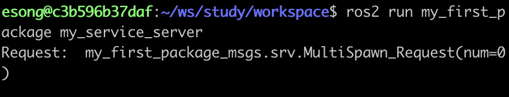
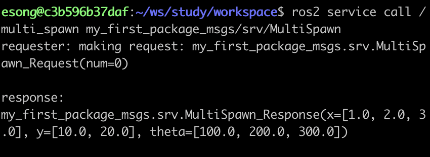
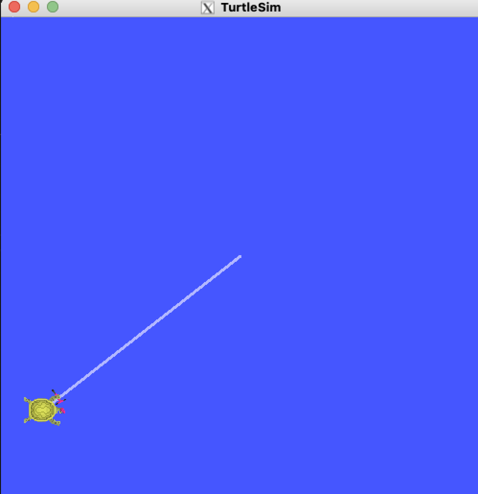
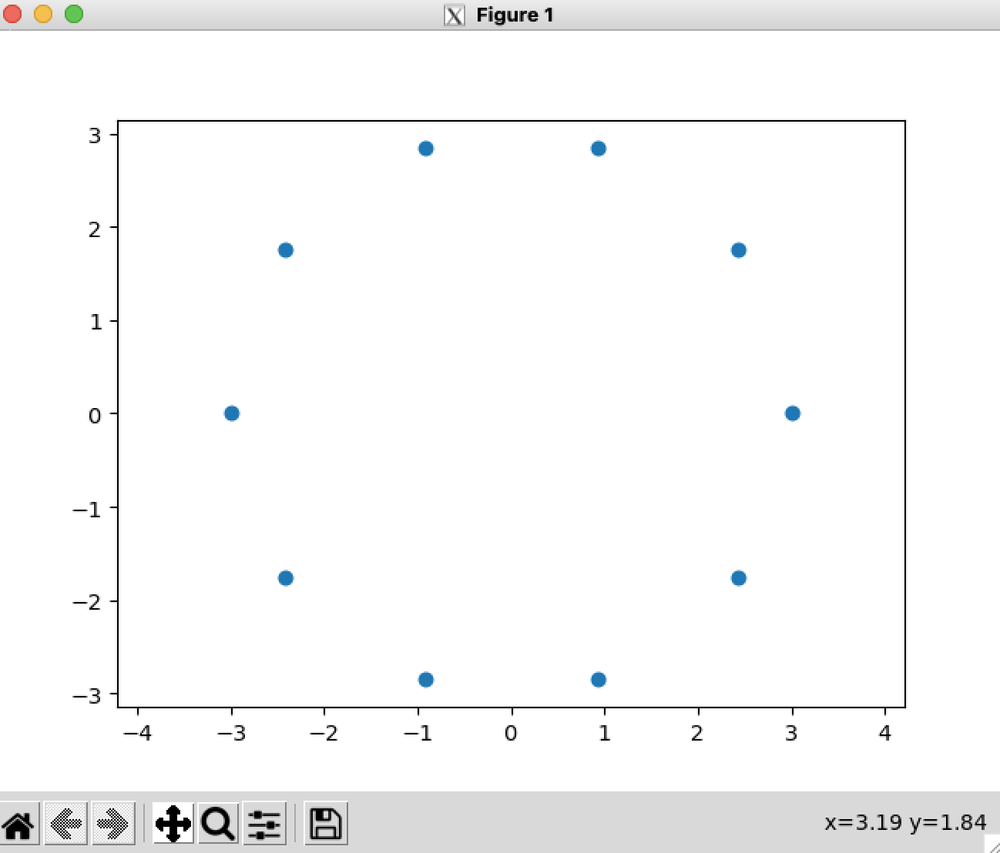
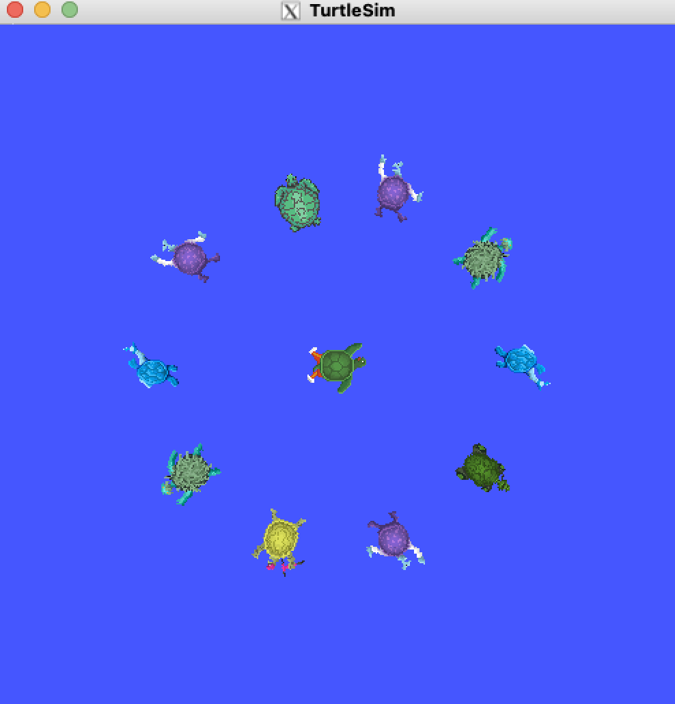

# 서비스 정의 만들기

## 서비스 정의 만들기
<br>

**서버스 정의 파일 작성하기**<br><br>
my_first_package_msgs/srv 폴더에 MultiSpawn.srv 파일 생성 후 아래 내용 적어주기

```bash
int64 num
---
float64[] x
float64[] y
float64[] theta
```
<br>

- **서비스를 정의는 꼭 srv 폴더에 위치해야 하는지**
    
    서비스 정의를 만들기 전에 srv 폴더를 먼저 만들고 시작했는데 무조건 폴더 이름을 srv로 해야하는 걸까.
    
    패키지 빌드를 할 때 colcon build 명령을 사용하여 빌드를 해준다. 이때 msg, srv, action 폴더 이름을 사용하고 알맞은 경로에 위치하여 정의를 만들어야지 빌드 시스템이 자동으로 인식하여 정상적으로 빌드가 된다.
<br><br>

- **서비스 정의 구조**
    
    ```bash
    <요청 필드>
    ---
    <응답 필드>
    ```
    
    정의 파일의 구조는 ---을 기준으로 두 개의 파트로 나누어 적어주어 한다.
    
    - **위쪽(--- 위)** : 클라이언트가 서버에게 보낼 요청 데이터 구조
    - **아래쪽(--- 아래)** : 서버가 클라이언트에게 돌려줄 응답 데이터 구조
<br><br>

**패키지 빌드 설정 파일 수정해주기 (CMakeListst.txt 파일 수정)**<br><br>
서비스 정의 파일을 만들었으면 `colcon build` 명령어 실행 시에 빌드가 잘 될 수 있도록 CMakeLists.txt 파일을 수정해주어야 한다.

CMakeLists.txt 파일은 **패키지 빌드 설정 파일**로, 패키지를 `colcon build` 명령어를 통해 **빌드할 때 어떤 소스/메세지/서비스/액션을 컴파일할지 정의하는 파일이다.**
<br><br>

1. **빌드에 필요한 패키지 찾기**
    
    ```
    find_package(rosidl_default_generators REQUIRED)
    ```
    
    - 메세지/서비스/액션을 자동으로 처리하기 위한 툴인 rosidl_defaul_generators 찾아주기
    - `REQUIRED` 는 반드시 필요하다는 의미로, rosidl_default_generators 패키지가 설치되어 있어야만 빌드를 진행한다.
<br><br>

2. **메세지/서비스/액션 파일 등록**
    
    ```
    rosidl_generate_interfaces(${PROJECT_NAME}
      "srv/MultiSpawn.srv"
    )
    ```
    
    - 여기에 등록된 메세지/서비스/액션 파일을 기반으로 c++/python 코드가 자동으로 생성된다.
    - 이후 패키지 빌드가 끝나면 노드에서 바로 사용할 수 있게 된다.

<br>

3. **의존성 설정해주기 (package.xml 파일 수정)**
    
    ```
    <build_depend>rosidl_default_generators</build_depend>
    <exec_depend>rosidl_default_runtime</exec_depend>
    <member_of_group>rosidl_interface_packages</member_of_group>
    ```
<br>

**빌드해주기**

1. **빌드하기**
    
    ```bash
    colcon build --packages-select my_first_package_msgs
    ```
    

1. **설정 환경 불러오기**
    
    ```bash
    source install/setup.bash
    ```
    

1. **잘 됐는지 확인**
    
    ```bash
    ros2 interface show my_first_package_msgs/srv/MultiSpawn
    ```
    
    ```bash
    int64 num                                                
    ---                                             
    float64[] x                                            
    float64[] y               
    float64[] theta
    ```
    

<br><br>

## 서버 만들기 1

우선은 간단하게 서비스 정의 사용해보기 위해, 요청 받고 임시값을 응답으로 보내는 서버 만들어보기<br><br>

```bash
from my_first_package_msgs.srv import MultiSpawn
import rclpy
from rclpy.node import Node

class MultiSpawning(Node):
    
        def __init__(self):
                super().__init__('multi_spawn')
                self.server = self.create_service(MultiSpawn, 'multi_spawn', self.callback_service)

        def callback_service(self, request, response):
                print('Request: ', request)
    
                response.x = [1., 2., 3.]
                response.y = [10., 20.]
                response.theta = [100., 200., 300.]
    
            return response
            
def main(args=None):
        rclpy.init(args=args)
        multi_spawn = MultiSpawning()

        rclpy.spin(multi_spawn)
        multi_spawn.destroy_node()
        rclpy.shutdown()

if __name__ == '__main__':
        main()
```
<br><br>

**빌드해주기**

1. **setup.py 파일 수정**
    
    ```bash
        entry_points={
            'console_scripts': [
                'my_first_node = my_first_package.my_first_node:main',
    			'my_subscriber = my_first_package.my_subscriber:main',
    			'my_publisher = my_first_package.my_publisher:main',
    			'turtle_cmd_and_pose = my_first_package.turtle_cmd_and_pose:main',
    			'my_service_server = my_first_package.my_service_server:main',
            ],
        },
    ```
    
2. **빌드해주기**
    
    ```bash
    colcon build --packages-select my_first_package
    ```
    
3. **환경 설정 불러오기**
    
    ```bash
    source install/setup.bash
    ```
<br>

**서비스에 요청 보내고 응답 받아보기**

1. **서버 실행**
    
    ```bash
    ros2 run my_first_package my_service_server
    ```
    
2. **서비스에 요청 보내기**
    
    ```bash
    ros2 service call /multi_spawn my_first_package/srv/MultiSpawn "{num: 2}"
    ```
    
3. **결과 확인**
    
    
    
    

<br><br>

## 서버 만들기 2

클라이언트로부터 요청이 들어오면, turtlesim 노드가 관리하는 거북이 한 마리를 특정 위치로 이동시키는 서비스 서버 만들기
<br><br>

```bash
from my_first_package_msgs.srv import MultiSpawn
from turtlesim.srv import TeleportAbsolute
import rclpy
from rclpy.node import Node

class MultiSpawning(Node):
	
	def __init__(self):
		super().__init__('multi_spawn')
		self.server = self.create_service(MultiSpawn, 'multi_spawn', self.callback_service)
		self.teleport = self.create_client(TeleportAbsolute, '/turtle1/teleport_absolute')
		self.req_teleport = TeleportAbsolute.Request()

	def callback_service(self, request, response):
		print('Request: ', request)

		self.req_teleport.x = 1.
		self.req_teleport.y = 2.
		self.teleport.call_async(self.req_teleport)

		return response

def main(args=None):
	rclpy.init(args=args)
	multi_spawn = MultiSpawning()

	rclpy.spin(multi_spawn)
	multi_spawn.destroy_node()
	rclpy.shutdown()

if __name__ == '__main__':
	main()
```
<br>

**콜백 함수에서 request랑 response 사용하지 않더라도 명시해주기**

```bash
		def callback_service(self, request, response):
		print('Request: ', request)

		self.req_teleport.x = 1.
		self.req_teleport.y = 2.
		self.teleport.call_async(self.req_teleport)
		
		return response
```

현재 서버는 요청이 들어오는 순간 요청값에 상관없이 무조건 거북이를 (1,2) 위치로 이동시키도록  서비스 요청을 보내고 있다. 사실상 현재 callback_service 함수에서는 인자로 전달된 request 와 response가 필요없고, 반환도 의미가 없다.

하지만 이렇다해도 인자에 request, response를 명시해야 하고, 반환도 해주어야 한다. rclpy가 서비스 요청이 들어오면 자동으로 request와 response 객체를 전달하는데, 만약 생략하면 python에서 인자 개수 불일치로 TypeError가 발생한다. 또한 반환해주지 않으면 클라이언트가 응답을 받지 않은 상태로 남게되니 무조건 해주어야 한다.
<br><br>

**결과 확인해보기**

1. **서버 노드와 turtlesim 노드 실행시켜두기**
    
    ```bash
    ros2 run my_first_package my_service_server
    ros2 run turtlesim turtlesim_node
    ```
    

1. **서비스에 요청 보내기**
    
    ```bash
    ros2 service call /multi_spawn my_first_package/srv/MultiSpawn
    ```
    

1. **결과 확인하기**

    

<br><br>

## 서버 만들기 3

클라이언트로부터 들어온 요청의 거북이 수만큼 거북이를 원 모양으로 배치하는 서버 만들어보기
<br><br>

**python으로 알고리즘 부분 먼저 개발**

ros에서 python 코드를 테스트하면 일일이 빌드하면서 진행해야 하니, 일단은 ros와 무관하게 python으로 알고리즘 부분 먼저 개발하고 그 코드를 ros에 맞게 변환해주기
<br><br>

1. **개수가 정해졌을 때 각 원 사이의 각도를 구하는 코드**
    
    원 둘레에 위치해야 할 원의 개수를 n 이라고 하면, 360도를 n으로 나누면 각 원 사이의 각도를 구할 수 있다.
    
    ```python
    import numpy as np
    
    n = 3
    to_degree = 180/np.pi
    
    gap_theta = 2*np.pi / n
    ```
    
    - **`to_degree`**: 라디안을 degree 단위로 변환할 때 사용할 변수
<br><br>

2. **gap_theta를 이용해서 원의 개수 n만큼의 각도를 미리 생성하여 list에 담아주기**
    
    ```python
    theta = [gap_theta*n for n in range(n)]
    ```
    
    - **`range(n)`**: 0부터 n-1까지 정수 생성
    - **`gap_theta*n for n in range(n)`**: range(n)로 0부터 n-1까지 반복하면서 각 값 n에 gap_theta 곱하고 그 결과를 리스트에 순서대로 넣기
<br><br>

3. **각 원의 좌표 구해주기**
    
    원의 반지름과 각도를 알면 삼각함수를 통해 좌표를 구할 수 있다.
    
    ```python
    r = 3
    x = r * np.cos(theta)
    y = r * np.sin(theta)
    ```
 <br>   

4. **scatter 함수의 좌표 찍어보기**
    
    ```python
    import matplotlib.pyplot as plt
    
    plt.scatter(x,y)
    plt.axes('equal')
    plt.show()
    ```
    
    - **`scatter(x,y)`**: **좌표 찍어주는 함수**. 위 코드의 경우에 리스트를 전달했으니 (x[0], y[0]), (x[1], y[1]), … , (x[n-1], y[n-1]) 좌표에 점을 직어줌
    - **`axes(’equal’)`**: matplotlib 기본 그래프는 화면에 맞춰 축 길이를 자동으로 조정함. 그래서 y축에서 1 단위 길이와 x 축에서 1 단위 길이가 다를 수 있다. 이러면 좌표를 찍었을 때 결과가 바라는 대로 안 나올 수 있다. 이때 **axes(’equal’)을 사용하면 x,y 축 단위 스케일을 동일하게 맞추어주기에 좌표의 실제 비율이 정확하게 유지된다.**
    - **`show()`**: **그려진 그래프를 화면에 띄어줌**
    <br><br>

    원의 개수를 10으로 하고 반지름을 3으로 했을 때 좌표 찍어보면:
    
    
<br>

5. **함수로 빼주기**<br>

    - **원을 배치하는 코드**
        
        ```python
        def calc_position(n, r):
        		gap_theta = 2*np.pi / n
        		theta = [gap_theta * n for n in range(n)]
        		x = [r*np.cos(th) for th in theta]
        		y = [r*np.sin(th) for th in theta]
        	
        		return x, y, theta
        ```
        
        - **x, y 리스트 구하는 코드를 for문으로 하나씩 처리하도록 변경해주었다**. `x = r * np.cos(theta)` 방식은 theta가 numpy array일 때 가능한 연산이라, 자동으로 theta가 numpy array로 형변환되고 있음
            
            원래 코드를 유지하면 x,y가 numpy array로 저장되니 python list로 값을 얻고 싶다면 for 문으로 하나씩 처리해주면 된다.
            
        <br>
    - **결과를 그래프로 확인하는 코드**
        
        ```python
        def draw_pos(x, y):
        		plt.scatter(x,y)
        		plt.axes('equal')
        		plt.show()
        ```

<br><br>

**여러 거북이 배치하는 서비스 서버 구현하기**<br>

1. **필요한 서비스와 모듈 import 해주기**
    
    ```python
    from turtlesim.srv import Spawn
    from numpy as np
    ```
    
    - **turtlesim.srv.Spawn**: turtlesim을 하나씩 만들어주기 위해 필요한 서비스 /spawn을 사용하기 위해 Spwan을 import 해준다.
    - **numpy**: 위에서 구현한 calc_position 함수에 필요한 numpy 모듈 import 해주기
    <br><br>

2. **/spawn 서비스 사용 준비하기**
    
    ```python
    self.spawn = create_client(Spawn, '/spawn')
    self.req_spawn = Spawn.Request()
    ```
    
    - 던더 init에 추가해주기
    - create_client 함수를 통해 서비스 서버와 통신할 클라이언트 객체 생성해주기
    - Spawn.Request() 를 통해 서비스 요청 시 보내줄 데이터 객체 생성해주기
    <br><br>

3. **turtlesim이 나타나는 화면이 센터값 저장해주기**
    
    turtlesim 화면의 좌표계는 (0,0)이 화면 좌측 하단이다. calc_position 함수를 구현할 때, (0,0)을 중심으로 가정하고 코드를 작성하였기에, calc_position 함수에서 반환한 (x,y)를 그대로 사용하면 원하는 위치에 거북이를 배치할 수 없다.
    
    따라서 화면의 중심 좌표를 구해서 오프셋 적용을 해주어야 한다.
    <br><br>

- **센터 좌표 구해주기**
    
    turtlesim 노드 실행하면 거북이가 화면 센터에 위치하게 된다. 
    
    노드 실행 후, pose 토픽에 발행되고 있는 pose 값을 아래 명령어를 통해 출력해보면 센터 좌표가 (5.54, 5.54) 임을 알 수 있다.
    
    ```bash
    ros2 topic echo /turtle1/pose
    ```
<br>

- **센터 좌표 저장해주기**
    
    ```python
    self.center_x = 5.54
    self.center_y = 5.54
    ```
<br>    

4. **callback_service 구현해주기**<br>
    
    ```python
    def callback_service(self, reqeust, response):
    		x, y, theta = self.calc_position(request.num, 3)
    		
    		for n in range(len(theta)):
    				self.req_spawn.x = x[n] + self.center_x
    				self.req_spawn.y = y[n] + self.center_y
    				self.req_spawn.theta = theta[n]
    				self.spawn.call_async(self.req_spawn)
    				
    		response.x = x
    		response.y = y
    		response.theta = theta
    
    		return response
    ```
    
<br>

5. **결과 확인하기**
    
    
    
