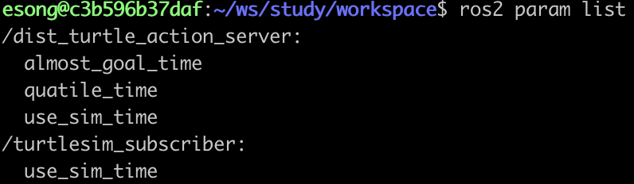
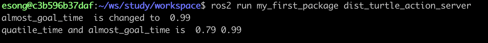
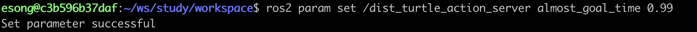
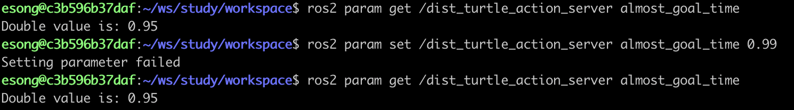

# 노드 코드 안에서 파라미터 사용

### 파라미터 등록<br><br>

지정한 이름과 값으로 파라미터를 등록해줄 수 있다:

```python
self.declare_parameter(<parameter_name>, <parameter_value>)
```

- declare_parameter 함수는 rclpy.node.Node의 멤버 함수이다. 노드 상속 후 위와 같이 사용할 수 있다.

<br>
my_first_package의 dist_turtle_action_server에 아래와 같이 파라미터를 등록했다:

```python
class DistTurtleServer(Node):
		def __init__(self):
				...
				self.declare_parameter('quatile_time', 0.75)
				self.declare_parameter('almost_goal_time', 0.95)
				...
```
<br>    

패키지 재빌드하고 노드 실행 후 파라미터 리스트를 확인하면:
```bash
ros2 param list
```


<br><br>

---
<br>

### 파라미터 변수로 저장하기<br><br>

파라미터를 변수로 저장해줄 수가 있다:

```python
(param1, param2) = self.get_parameters([<parameter_name>, <parameter_name>])
```

- get_parameters 함수는 파라미터 객체를 리스트 형태로 반환하며, 괄호 안 변수에 순서대로 파라미터 객체가 저장된다.
<br><br>

변수에 저장된 파라미터 객체는 `.`을 통해 파라미터 이름과 값에 접근할 수 있다:

```python
param1.name
param1.value
```
<br>

---
<br>

### 파라미터 값이 변경될 때 호출될 콜백함수 등록<br><br>

노드가 실행 중일때 파라미터 값이 바뀌면 호출될 콜백함수를 등록해줄 수 있다:

```python
from rcl_interfaces.msg import SetParameterResult

self.add_on_set_parameters_callback(<callback_function>)
```
<br>

콜백함수 작성해보기:

```python
...

self.declare_parameter('quatile_time', 123)
self.declare_parameter('almost_goal_time', 'hello')

(quatile_time, almost_goal_time) = self.get_parameters(['quatile_time', 'almost_goal_time'])
self.quatile_time = quatile_time.value
self.almost_goal_time = almost_goal_time.value

self.add_on_set_parameters_callback(self.callback_parameter)
	
...
	
def callback_parameter(self, params):
		for param in params:
				print(param.name, " is changed to ", param.value)

				if param.name == 'quatile_time':
						self.quatile_time = param.value
				if param.name == 'almost_goal_time':
						self.almost_goal_time = param.value

			print('quatile_time and almost_goal_time is ', self.quatile_time. self.almost_goal_time)
		
			return SetParametersResult(successful=True)
```

- callback_parameter 입력으로 params를 받도록 해주면 set 명령이 적용되어 변경된 파리미터 객체들이 리스트형으로 반환된다.
<br><br>

콜백함수를 위와 같이 작성해주고 실행 후, 파라미터 변경해보면:





`SetParameterResult(successful=True)` 반환은 **변경 요청을 성공적으로 처리했다** 라고 RO2에 알려주는 거다. 만약 False로 해서 반환을 하면 파라미터 변경이 거부된다:


