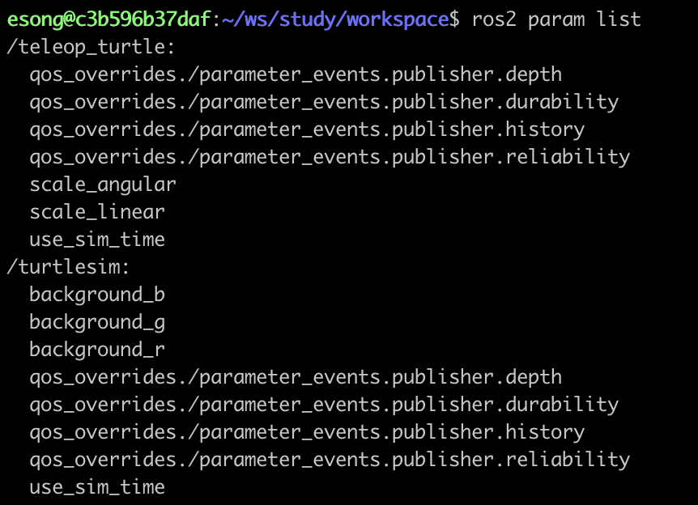
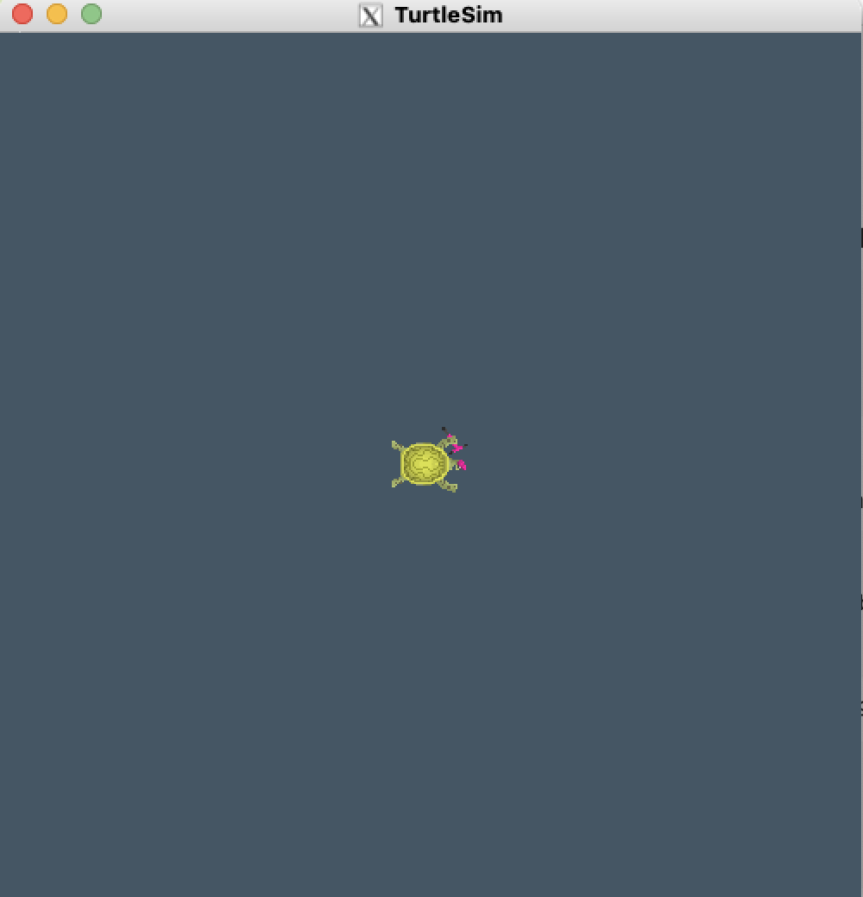
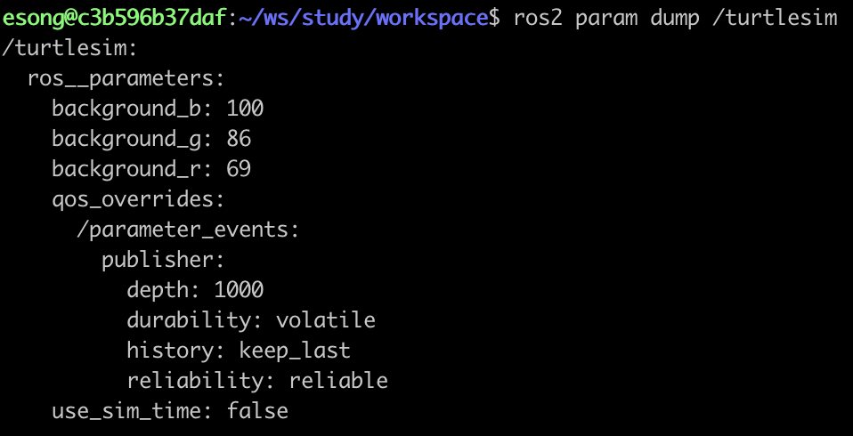

# 파라미터 기본 명령어 익히기
<br>

### 파라미터란

노드의 동작을 실행 중에 바꿀 수 있게 해주는 설정값이다.<br>
각 노드마다 독립적으로 존재하며, 실행 중에도 변경 가능하다는 특징이 있다. 또한 현재 파라미터 상태를 yaml 파일로 저장하여 다음에 재사용할 수 있다.

<br>

---
<br>

### 파라미터 리스트 보기<br><br>

1. **/turtlesim 노드와 /teleop_turtle 노드 실행하기**
    
    ```bash
    ros2 run turtlesim turtlesim_node
    ```
    
    ```bash
    ros2 run turtlesim turtle_teleop_key
    ```
    <br>

1. **두 노드의 파라미터 살펴보기**
    
    ```bash
    ros2 param list
    ```
    
    /turtlesim과 /teleop_turtle 각 노드에 대한 파라미터들이 출력된다:
    
    
    
<br>

---
<br>

### 파라미터 값 살펴보기<br><br>

파리미터의 현재 값을 확인하고 싶을 때는 아래의 명령어를 사용하면 된다:

```bash
ros2 param get <node_name> <parameter_name>
```
<br>

`ros2 param list` 명령어를 통해 출력된 /turtlesim의 파라미터 중 background_b의 값을 확인하려면:

```bash
ros2 param get /turtlesim background_b
```

아래와 같이 출력된다:

```bash
Integer value is: 255
```

- background_b 값이 integer이며 255라는 값을 가진다는 걸 알 수 있다.
<br><br>

---
<br>

### 파라미터 값 바꿔보기<br><br>


파라미터의 현재 값을 바꿔주고 싶을 때는 아래의 명령어를 사용하면 된다:

```bash
ros2 param set <node_name> <value>
```
<br>

/turtlesim의 파라미터인 background_b의 값을 바꾸려면:

```bash
ros2 param set /turtlesim background_b 100
```

아래의 출력과 함께 turtlesim 윈도우의 배경화면이 바뀐다 :

```bash
Set parameter successful
```



`set` 명령어를 통해 파라미터 값을 바꾸면, 현재 실행 중인 노드에 대해서만 적용이 되며 노드를 재실행하면 초기값으로 세팅이 된다.<br>
만약 세팅을 저장하고 다음 노드 실행 시에도 적용해주고 싶다면 `param dump` 명령어를 사용해주면 된다.
<br><br>

---
<br>

### 노드의 현재 파라미터 값 저장하기

노드 실행 후 파라미터 값을 수정한 뒤 현재 세팅을 파일로 저장하여 다음 노드 실행 때 사용할 수 있는 방법이 있다.
<br><br>

아래의 명령어를 입력하면, 현재 실행 중인 노드의 파라미터 값들을 YAML 형식으로 출력해준다:

```bash
ros2 param dump <node_name>
```



위의 출력을 yaml 확장자 파일에 저장하여 다음 노드 실행 때 사용하여 세팅을 적용시켜줄 수 있다.
<br><br>

예를 들어, 위에서 turtlesim의 background_b 값을 수정했던 걸 다음번 노드 실행 때도 적용시켜주기 위해 파일로 저장해두고 싶다면:

```bash
ros2 param dump /turtlesim > turtlesim.yaml
```
<br>

---
<br>

### 노드에 파라미터 파일 적용시켜주기<br><br>

새로운 /turtlesim 노드 실행 후, 위에서 저장해두었던 turtlesim.yaml 파일을 적용시켜줄 수 있다:

```bash
ros2 param load <node_name> <parameter_file>
```
<br>

이미 실행 중인 노드에 적용하는 게 아니라, 노드를 실행할 때 파일을 load 해주는 방법도 있다:

```bash
ros2 run <package_name> <node_name> --ros-args --params-file <param_file>
```
